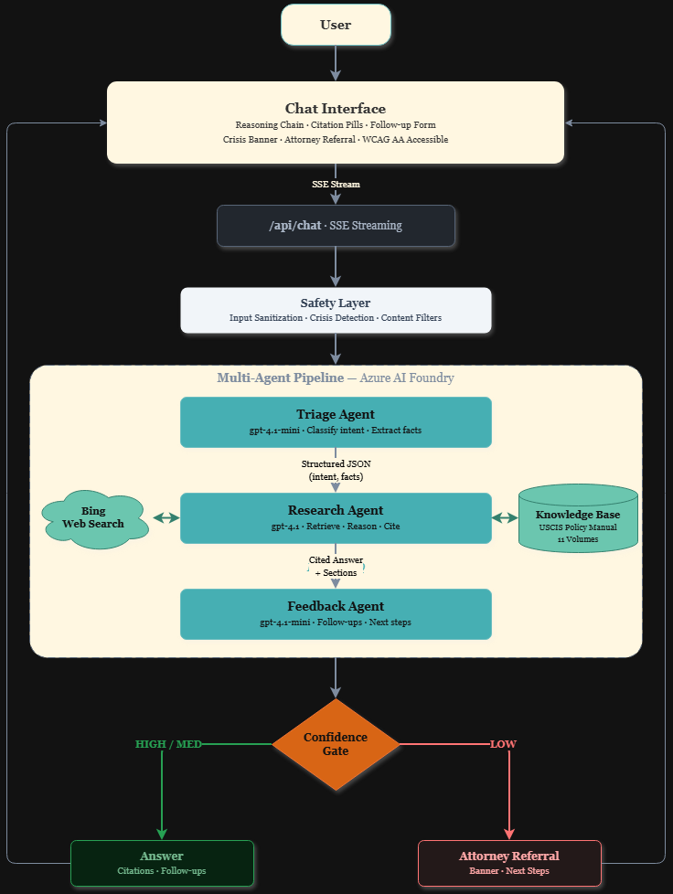

<p align="center">
  
</p>

<h1 align="center">Solace</h1>

<p align="center">
  An AI-powered immigration rights agent that helps immigrants understand their legal rights in the United States — grounded in federal sources, with a confidence gate that refers users to attorneys when claims can't be cited.
</p>

<p align="center">
  
  
  
  
  
  
</p>

<p align="center">
  Built for the <strong>Microsoft Agents League Hackathon</strong> · Creative Apps Track
</p>

<p align="center">
  <a href="https://asksolace.vercel.app/"><strong>Try Solace Live →</strong></a>
</p>

<p align="center">
  
</p>

## 💡 The Problem

> Over 45 million immigrants live in the United States. When faced with legal questions — about work authorization, asylum, detention, or family petitions — most can't afford an immigration attorney, and the information available online is fragmented, outdated, or misleading.

Solace bridges that gap. It provides accurate, cited legal information grounded in the USCIS Policy Manual and current federal sources, while clearly distinguishing between what it can confidently answer and when a user should consult a licensed attorney.

## ✨ Features

### 🤖 AI Pipeline

- **Multi-agent reasoning**

  | Agent | Model | Role | Why this model? |
  |-------|-------|------|-----------------|
  | **Triage Agent** | gpt-4.1-mini | Classifies intent, extracts structured facts (visa type, status, dates), assesses complexity | Fast + cheap — classification doesn't need deep reasoning |
  | **Research Agent** | gpt-4.1 | Searches Bing + USCIS Knowledge Base, reasons over sources, writes a cited answer with confidence assessment | Full-size model for multi-source legal reasoning and citation accuracy |
  | **Feedback Agent** | gpt-4.1-mini | Identifies information gaps, generates follow-up questions with multiple-choice options, recommends next steps | Structured output from existing context — no retrieval needed |
- **Foundry IQ knowledge grounding** — 11 volumes of the USCIS Policy Manual indexed via Azure AI Search, plus Bing web search for current policy updates
- **Confidence gate** — Research agent self-assesses confidence (HIGH/MEDIUM/LOW). The answer is always delivered, but low-confidence responses are accompanied by an attorney referral banner with specific next steps — Solace informs, it never withholds

### 🎨 User Experience

| Feature | What it does | Why |
|---------|-------------|-----|
| **Real-time reasoning chain** | Users watch triage, tool calls, and research sections stream in live | Responses take 15–20s across three agents — transparency beats a spinner |
| **Citation pills** | Every claim links back to its source as clickable chips | Legal information without a source is just an opinion |
| **Follow-up form** | Interactive multiple-choice questions to refine the user's situation | Immigration cases are fact-specific — the first question rarely has enough detail |
| **Conversation memory** | Follow-up questions retain context from prior exchanges | Users shouldn't have to re-explain their situation every message |

### 🛡️ Safety & Accessibility

| Decision | Why |
|----------|-----|
| Crisis hotlines surface *before* the agent pipeline starts | Someone in crisis needs help in milliseconds, not after 15 seconds |
| LOW confidence still delivers the answer + attorney referral | Withholding information from a vulnerable person is worse than showing it with a clear warning |
| Prompt injection handled by Azure content filters, not client-side | A legal tool must be tamper-resistant at the model layer |
| Structured JSON audit logging on every interaction | Legal information tools need auditability |
| WCAG AA, ARIA, screen reader, `prefers-reduced-motion` built in | Immigrants may rely on assistive technology — accessibility isn't optional |

## 🏗️ Architecture

Solace uses a three-agent pipeline that mirrors how an immigration law firm handles intake — a paralegal screens the case, a specialist researches the law, and a follow-up consultation identifies what's missing. Splitting responsibilities lets each agent use the right model: gpt-4.1-mini for fast classification, gpt-4.1 for deep reasoning.

**1.** User submits a question → **2.** Triage Agent classifies intent, extracts facts, assesses complexity → **3.** Research Agent searches Bing + USCIS Knowledge Base, reasons over sources, writes a cited answer → **4.** Feedback Agent identifies gaps, generates follow-up questions, recommends next steps → **5.** Confidence Gate always delivers the answer, but adds an attorney referral banner when confidence is LOW.

<p align="center">
  
</p>

**Foundry IQ layer:** The Research Agent is grounded in a knowledge base containing the USCIS Policy Manual (Volumes 1–4, 6–12), indexed with `text-embedding-3-small` embeddings via Azure AI Search. Combined with Bing web search, this ensures answers are sourced from authoritative federal documents and current policy.

## 🧰 Tech Stack

| Layer | Technology |
|-------|-----------|
| Frontend | React 19, Tailwind CSS 4, TypeScript |
| Backend | Next.js 16 (App Router, API Routes, SSE streaming) |
| AI Agents | Azure AI Foundry (3 agents), gpt-4.1, gpt-4.1-mini |
| Knowledge | Azure AI Search, USCIS Policy Manual (11 volumes) |
| Web Search | Bing Search via Foundry MCP tools |
| Auth | `DefaultAzureCredential` (local), `ClientSecretCredential` (production) |
| Deployment | Vercel |


## 📋 Judging Criteria Alignment

| Criterion | Weight | How Solace Addresses It |
|-----------|--------|-------------------------|
| **Accuracy & Relevance** | 20% | Grounded in 11 volumes of the USCIS Policy Manual via Foundry IQ + Bing web search; citations link every claim to its source |
| **Reasoning & Multi-step Thinking** | 20% | Three-agent pipeline — triage classifies and extracts facts, research retrieves and reasons across sources, feedback identifies gaps and generates follow-ups |
| **Creativity & Originality** | 15% | Real-time reasoning chain lets users watch the agent think; confidence gate supplements answers with attorney referrals instead of withholding information; crisis detection surfaces hotlines for users in distress |
| **UX & Presentation** | 15% | Calming visual design, streaming answers, interactive follow-up form, citation pills, mobile-responsive, custom animations |
| **Reliability & Safety** | 20% | Azure content filter guardrails, input sanitization, distress detection, structured audit logging, confidence-based attorney referral, legal disclaimer |
| **Community Vote** | 10% | [Vote on Discord](https://aka.ms/agentsleague/discord) |


## 🧪 Testing

```bash
npm test
```

The `StreamParser` — which handles real-time SSE chunk parsing, section header detection, and cross-section content buffering — is covered by 7 test cases:

| Test | What it verifies |
|------|-----------------|
| Split headers | Section headers split across multiple chunks are buffered and reassembled |
| Multi-header chunks | Multiple section headers in a single chunk are parsed sequentially |
| Bracket disambiguation | Regular brackets like `[Form I-485]` are not mistaken for section headers |
| Cross-section flush | Content before a new section is tagged with the previous section |
| Empty deltas | Empty input produces no events |
| Buffer drain | `flush()` emits remaining buffered text at end of stream |
| Realistic sequence | Multi-chunk simulation combining regular brackets, section switches, and streamed content |

## 🤝 GitHub Copilot

Copilot was used throughout development — both inline completions and Copilot Chat. Examples include:

- **Design** — Identified SSE stream parsing edge cases (split boundaries, multi-event chunks, partial JSON) before implementation, shaping the buffering logic in the orchestrator
- **Explaining** — Clarified Azure AI Foundry SDK patterns, MCP tool approval flows, and SSE event encoding
- **Integrating** — Helped scaffold the distress detection flow in the API route, including SSE event prepending for crisis resources
- **Refactoring** — Extracted the streaming content parser from a 50-line closure into a standalone `StreamParser` class with clean buffer management
- **Testing** — Generated Jest test cases for `StreamParser` covering chunk splitting, cross-section flushing, and bracket disambiguation

See `public/copilot_usage/` for annotated screenshots of each interaction.

## 🚀 Getting Started

### Prerequisites

- Node.js 18+
- An [Azure AI Foundry](https://ai.azure.com) project with:
  - Three deployed agents (Triage, Research, Feedback)
  - A gpt-4.1 model deployment
  - Azure AI Search resource with a knowledge base
  - Bing Search MCP tool connected to the Research agent
- Azure CLI (`az login` for local authentication)

### Installation

```bash
git clone https://github.com/makseliseev/solace.git
cd solace
npm install
```

### Environment Variables

Create a `.env.local` file in the `solace/` directory:

```env
AZURE_FOUNDRY_ENDPOINT=https://your-resource.services.ai.azure.com/api/projects/your-project
AZURE_TRIAGE_AGENT_ID=your-triage-agent-name
AZURE_RESEARCH_AGENT_ID=your-research-agent-name
AZURE_FEEDBACK_AGENT_ID=your-feedback-agent-name
```

### Run Locally

```bash
npm run dev
```

Open [http://localhost:3000](http://localhost:3000).

### Deploy to Vercel

The app deploys to Vercel with the same environment variables above, plus service principal credentials for Azure authentication:

```env
AZURE_TENANT_ID=your-tenant-id
AZURE_CLIENT_ID=your-client-id
AZURE_CLIENT_SECRET=your-client-secret
```

<details>
<summary><strong>Project Structure</strong></summary>

```
solace/
├── app/
│   ├── api/chat/route.ts       # SSE streaming endpoint
│   ├── page.tsx                # Chat UI + state management
│   ├── layout.tsx              # Root layout + metadata
│   └── globals.css             # Tailwind + animations
├── components/
│   ├── ChatMessages.tsx        # Message list + attorney banner + next steps
│   ├── ChatInput.tsx           # Input + starter chips
│   ├── ReasoningChain.tsx      # Real-time reasoning visualization
│   └── FollowUpForm.tsx        # Interactive follow-up questions
├── lib/
│   ├── agentOrchestrator.ts    # Three-agent pipeline + SSE events
│   ├── streamParser.ts         # SSE chunk parser + section tracker
│   ├── foundryClient.ts        # Azure AI Foundry client singleton
│   ├── parseCitations.ts       # Citation extraction + pill formatting
│   ├── safety.ts               # Input sanitization + crisis detection
│   ├── auditLog.ts             # Structured JSON audit logging
│   ├── types.ts                # Shared TypeScript types
│   └── tests/                  # Jest test suites (50 tests)
│       ├── streamParser.test.ts
│       ├── safety.test.ts
│       └── parseCitations.test.ts
└── public/
    ├── solace_logo.png         # Logo assets
    └── copilot_usage/          # Copilot Chat screenshots
```

</details>

---

> **Disclaimer:** Solace provides **legal information, not legal advice**. The information is grounded in publicly available federal sources including the USCIS Policy Manual, but immigration law is complex and fact-specific. Solace includes a confidence gate that recommends consulting a licensed immigration attorney when it cannot provide a well-sourced answer. Always verify information with a qualified legal professional before making decisions about your immigration case.

## 📄 License

MIT
